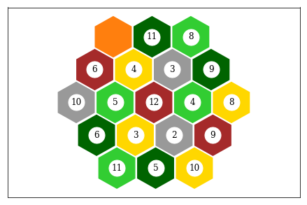

# Optimal Catan

Generate an 'optimal' Settlers of Catan board where:

- No two of the same resources are adjacent. 
- Lumber and brick are not adjacent (take that road builders!)
- None of the same numbers are on the same resource
- 6's and 8's aren't adjacent and all on separate resources. 
- None of the same numbered markers are adjacent.



Written with MiniZinc 2.2.1. There are two models, one generates the board layout and the other generates the markers for the board. They can be generated all at once:

```
$ ./gen_island.sh $(( ( RANDOM % 10000 )  + 1 ))
```

Where or you can provide your own random seed, otherwise the island will always be based on the first solution the models find.

<!-- ## [Read more]() -->

